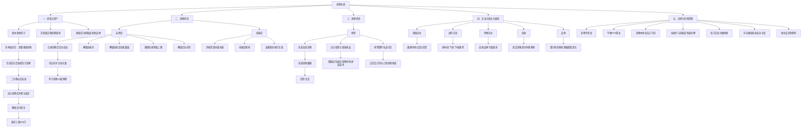
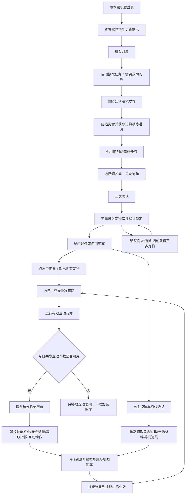

# 宠物系统策划设计文档

## 文档身份
- 原始文件：宠物系统策划设计文档.md
- 文档类型：md
- 所属模块：项目专项案例库、策划输入、宠物系统
- 状态：converted
- 入库模式：资料归档优先

## 资料摘要

宠物系统策划设计文档 文档首页 版本修订记录 设计目的 本模块说明宠物系统的整体目标：以宠物栏位承载长期养成，以犬种皮肤承载外观表达，以狗窝承接局内入口和轻经营。玩家通过任务解锁首个宠物栏位，通过局内互动提升亲密度，通过技能随机形成栏位差异，通过犬种皮肤表达偏好。 设计思路、结构树与玩家循环 4.1 设计思路 宠物系...

## 原文结构转写

- 宠物系统策划设计文档
- 1. 文档首页
- 2. 版本修订记录
- 3. 设计目的
- 4. 设计思路、结构树与玩家循环
- 4.1 设计思路
- 4.2 宠物系统结构树
- 4.3 玩家循环流程
- 5. 系统总架构
- 6. 宠物栏位获取、主界面与外观资产规则
- 6.1 首个宠物栏位获取
- 6.2 后续宠物栏位解锁
- 6.3 宠物栏位与犬种皮肤关系
- 6.4 犬种皮肤获取与重复转化
- 6.5 宠物主界面
- 7. 功能宠定位、宠物栏位、技能栏与宠物互动
- 7.1 定位说明
- 7.2 宠物栏位规则
- 7.3 技能栏规则
- 7.4 能力分类
- 7.5 宠物互动
- 8. 宠物栏位养成
- 8.1 养成定位与边界
- 8.2 亲密度规则与数值预期
- 8.3 技能栏解锁与随机技能
- 8.4 技能库、技能等级与技能升级
- 8.5 技能随机、锁定与结果确认
- 8.6 亲密度带来的解锁效果
- 8.7 宠物背包技能
- 9. 宠物经营
- 9.1 经营模块定位
- 9.2 狗窝定位与属性配置
- 狗窝伤害规则
- 9.3 狗窝权限与局内使用
- 9.4 自主探险与离线收益
- 9.5 狗窝摧毁、拆除、失效与收益规则
- 拆除确认
- 狗窝风险边界
- 9.6 局内表现与可见性边界
- 10. 犬种皮肤、动作与商业化

## 明确规则 / 决策

- 宠物系统的核心体验从“获得一只狗”开始，但不应停留在一次性领取。
- 玩家需要在局内前哨站完成救助与建造任务，将宠物、狗窝、狗粮等道具和局内生存建造体验建立联系。获得宠物后，玩家通过狗窝查看所有已拥有宠物，并选择某只狗跟随。
- B1 --> B2[前哨站任务：需要救助的狗]
- C --> D[自动接取任务：需要救助的狗]
- | 2 | 进入战局 | 自动接取任务“需要救助的狗”。 |
- | 单只跟随 | 同一时间只能 1 个宠物栏位对应的宠物在局内跟随。 |
- | 局内跟随 | 同一时间只能选择 1 个栏位对应宠物跟随。 |
- 技能库绑定宠物栏位。技能等级属于宠物栏位的技能库等级，已装备技能读取该栏位对应技能的等级效果。犬种皮肤不携带技能，不影响技能库。
- | 指令体验 | 指令理解 | 提升跟随、待机、召回、回窝等指令响应体验。 | 提升响应速度或异常恢复。 | 不改变战斗能力。 |
- | 锁定限制 | 至少保留 1 个可随机技能栏，不能全锁。 |
- 宠物背包是通用技能之一，不是宠物栏位基础属性。只有宠物栏位随机并装备宠物背包技能后，才开放对应背包能力。背包格子和可存放物品类型由技能等级和策划配置控制。
- 宠物经营围绕狗窝、自主探险、离线收益和局内入口展开。经营收益必须轻量、可控、受狗窝状态约束。

## 案例经验

以下保留原文主体，供 AI 检索和人工回溯。

## 待确认 / AI 推论

- 本模块说明宠物栏位如何解锁、犬种皮肤如何获得，以及玩家如何在宠物主界面管理栏位和外观。宠物栏位是养成主体，首个栏位通过前哨站任务解锁，后续栏位可通过商业化、活跃活动、养成功能等路径解锁；犬种皮肤只改变外观表现，不改变栏位的亲密度、技能栏、技能库等级和当前技能。
- ### 6.2 后续宠物栏位解锁
- 后续宠物栏位用于扩展玩家的长期养成空间。首期宠物栏位上限为 3 个，同一时间仍只能选择 1 只宠物跟随。
- | 配件 | 外观扩展 | 首期不独立制作，可作为犬种皮肤的一部分；后续可扩展为独立外观系统。 |
- | 配件 | 外观扩展 | 否 | 首期作为犬种皮肤一部分描述，后续可独立。 |
- | 动作 | 互动动作、待机表现、展示动作等。 | 可作为外观表现或后续商业化内容。 |
- | 配件 / 动作 | 首期作为犬种皮肤表现，后续可扩展为独立外观内容。 | 不提供规则能力差异。 |
- | 后续宠物栏位解锁 | 2/3 号栏位通过商业化、活跃活动、养成功能等路径解锁。 | P0 |

## 检索关键词

1. 文档首页、2. 版本修订记录、3. 设计目的、4. 设计思路、结构树与玩家循环、4.1 设计思路、4.2 宠物系统结构树、4.3 玩家循环流程、宠物系统、宠物系统策划设计文档、策划输入、项目专项案例库

## 来源定位

- 文件：宠物系统策划设计文档.md
- 位置：按原文标题和段落回溯。

---

## 原文主体

# 宠物系统策划设计文档

## 1. 文档首页

| 项目 | 内容 |
| --- | --- |
| 文档名称 | 宠物系统策划设计文档 |
| 文档版本 | V0.9 |
| 适用项目 | 生存探索建造对抗类长单局游戏 |
| 当前版本对象 | 当前版本仅开放宠物狗，系统名仍使用宠物系统 |
| 核心模型 | 宠物栏位是养成主体；犬种皮肤是外观表现；技能随机和技能库等级绑定宠物栏位 |
| 核心定位 | 长期陪伴、局内便利、弱信息判断、外观表达、轻经营，不提供直接战斗能力 |
| 核心边界 | 同一时间只能 1 只宠物跟随；犬种皮肤不改变亲密度、技能栏、技能库等级、当前技能或背包能力 |

## 2. 版本修订记录

| 版本 | 日期 | 作者 | 修订内容 |
| --- | --- | --- | --- |
| V0.1 | 2026-06-02 | 龚浩添 | 基于宠物系统框架脑图，整理初版策划文档。 |
| V0.2 | 2026-06-02 | 龚浩添 | 删除养殖宠独立模块；功能宠拆分为狗、猴子、鸟类。 |
| V0.3 | 2026-06-03 | 龚浩添 | 收束为狗；补充皮肤领取、宠物库、亲密度、训练树、性能边界。 |
| V0.4 | 2026-06-10 | 龚浩添 | 明确只做宠物狗；宠物仅自己可见；补充狗窝、离线探险、狗背包和宠物外观口径。 |
| V0.5 | 2026-06-11 | 龚浩添 | 宠物训练调整为旧版能力学习与强化；新增能力训练书；补充能力格子与亲密度限制；宠物背包调整为能力内容；“搞怪能力”更名为“宠物互动”。 |
| V0.6 | 2026-06-12 | 龚浩添 | 调整宠物获取、局内陪伴成长、技能库、单狗独立养成、结构树与玩家循环。 |
| V0.6.1 | 2026-06-12 | 龚浩添 | 补充首只宠物领养二次确认和技能替换确认流程。 |
| V0.7 | 2026-06-13 | 龚浩添 | 能力承载统一为技能栏；模块 8/9 合并为宠物养成，模块 10/11/12 合并为宠物经营；明确亲密度每日共享次数、技能库、技能升级、互动动作和皮肤/品种口径。 |
| V0.8 | 2026-06-17 | 龚浩添 | 明确外观来源、栏位养成、技能随机与材料替换、犬种皮肤商业化。 |
| V0.9 | 2026-07-01 | 龚浩添 | 重构为宠物栏位养成模型：犬种皮肤与养成解耦，技能改为栏位随机与锁定规则，更新功能点、资源边界、风险控制和大厅服 / 战斗服拆分。 |

## 3. 设计目的

本模块说明宠物系统的整体目标：以宠物栏位承载长期养成，以犬种皮肤承载外观表达，以狗窝承接局内入口和轻经营。玩家通过任务解锁首个宠物栏位，通过局内互动提升亲密度，通过技能随机形成栏位差异，通过犬种皮肤表达偏好。

| 目标 | 说明 |
| --- | --- |
| 长期陪伴 | 宠物栏位承载亲密度、技能栏、技能库等级和当前技能，形成长期养成对象。 |
| 外观表达 | 犬种皮肤改变狗的模型、毛色、主题外观和部分表现，不改变养成强度。 |
| 局内锚点 | 狗窝作为局内功能摆件，承接宠物界面、跟随选择、自主探险和离线收益。 |
| 弱便利能力 | 技能提供搜索判断、风险预警、交互效率、背包等便利能力，不提供自动攻击和 PVP 雷达。 |
| 商业化边界 | 商业化可售卖犬种皮肤、外观内容和宠物栏位解锁路径，但不得改变单只跟随、技能等级或技能强度规则。 |

## 4. 设计思路、结构树与玩家循环

### 4.1 设计思路

宠物系统的核心体验从“获得一只狗”开始，但不应停留在一次性领取。

玩家需要在局内前哨站完成救助与建造任务，将宠物、狗窝、狗粮等道具和局内生存建造体验建立联系。获得宠物后，玩家通过狗窝查看所有已拥有宠物，并选择某只狗跟随。

亲密度通过召唤宠物后的有效互动提升。每日有效次数由所有宠物共享，用于控制多宠物同时成长。

宠物能力通过技能栏生效。不同品种的宠物拥有不同数量的技能栏，技能栏按亲密度等级解锁。技能内容来自技能库，技能等级通过消耗资源升级，并受到亲密度等级限制。

### 4.2 宠物系统结构树

### 4.3 玩家循环流程

入口设计：

局外宠物主界面：大厅主界面入口

局内宠物主界面：中控台入口，打开界面与局外的一致，但会限制某些操作（洗技能）

狗窝界面：与狗窝交互

## 5. 系统总架构

本模块说明宠物系统的对象关系。宠物栏位是所有养成数据的归属点；犬种皮肤、动作和配件表现是装备在栏位上的外观内容；狗窝是局内入口；技能库和技能栏决定栏位能力。

| 层级 | 对象 | 核心规则 |
| --- | --- | --- |
| 账号层 | 宠物栏位 | 首期最多 3 个，栏位承载亲密度、技能栏、技能库等级、当前技能和跟随状态。 |
| 外观层 | 犬种皮肤 | 装备到宠物栏位上，可通过商业化、活跃、活动、成就等路径获得。 |
| 养成层 | 亲密度 | 决定技能栏解锁、技能库解锁、技能等级上限和互动动作解锁。 |
| 能力层 | 技能栏 / 技能库 | 技能栏解锁时随机获得技能；技能等级属于宠物栏位的技能库等级。 |
| 局内层 | 狗窝 | 局内功能摆件，可建造多个，打开同一宠物界面，不叠加收益。 |
| 表现层 | 跟随 / HUD / 互动 | 同一时间只能 1 只宠物跟随，宠物本体仅玩家自己可见。 |
| 商业化层 | 犬种皮肤 / 栏位解锁 / 订阅等 | 可提供外观和栏位获取路径，不提供额外跟随数量或技能强度。 |

## 6. 宠物栏位获取、主界面与外观资产规则

本模块说明宠物栏位如何解锁、犬种皮肤如何获得，以及玩家如何在宠物主界面管理栏位和外观。宠物栏位是养成主体，首个栏位通过前哨站任务解锁，后续栏位可通过商业化、活跃活动、养成功能等路径解锁；犬种皮肤只改变外观表现，不改变栏位的亲密度、技能栏、技能库等级和当前技能。

### 6.1 首个宠物栏位获取

首个宠物栏位用于完成宠物系统教学。玩家通过局内前哨站任务解锁 1 号宠物栏位，并获得默认犬种皮肤。

| 步骤 | 玩家操作 | 系统反馈 |
| --- | --- | --- |
| 1 | 登录游戏 | 弹出宠物功能更新提示，说明宠物栏位、狗窝和犬种皮肤。 |
| 2 | 进入战局 | 自动接取任务“需要救助的狗”。 |
| 3 | 与前哨站狗 NPC 交互 | 打开任务说明，展示建造狗窝、获取狗粮等目标。 |
| 4 | 完成目标并提交 | 解锁 1 号宠物栏位，赠送默认犬种皮肤。 |
| 5 | 确认领养 | 进入宠物主界面，展示 1 号栏位、亲密度、技能栏和外观入口。 |

### 6.2 后续宠物栏位解锁

后续宠物栏位用于扩展玩家的长期养成空间。首期宠物栏位上限为 3 个，同一时间仍只能选择 1 只宠物跟随。

| 栏位 | 解锁方向 | 说明 |
| --- | --- | --- |
| 1 号栏位 | 前哨站任务 | 默认开放，承担教学和基础养成。 |
| 2 号栏位 | 商业化、活跃活动、养成功能等 | 作为中期养成目标或运营投放内容。 |
| 3 号栏位 | 商业化、活跃活动、养成功能等 | 作为长期养成目标或高阶运营投放内容。 |

### 6.3 宠物栏位与犬种皮肤关系

宠物栏位和犬种皮肤完全解耦。栏位保存养成数据，犬种皮肤负责外观表现。玩家更换犬种皮肤时，栏位的亲密度、技能栏、技能库等级、当前技能和背包技能不发生变化。

| 对象 | 归属 | 说明 |
| --- | --- | --- |
| 宠物栏位 | 账号养成数据 | 承载亲密度、技能栏、技能库等级、当前技能、当前跟随状态。 |
| 犬种皮肤 | 外观资产 | 改变犬种模型、毛色、主题外观和部分动作表现。 |
| 配件 | 外观扩展 | 首期不独立制作，可作为犬种皮肤的一部分；后续可扩展为独立外观系统。 |
| 动作表现 | 外观 / 互动表现 | 可由亲密度或犬种皮肤表现触发，不改变技能强度。 |

### 6.4 犬种皮肤获取与重复转化

犬种皮肤可通过商业化、活跃、活动、成就等路径获得。重复获得已拥有犬种皮肤时，自动转化为指定外观相关道具。

| 规则项 | 规则 |
| --- | --- |
| 获取来源 | 商城、订阅、活跃活动、成就、运营活动、任务奖励等。 |
| 重复转化 | 重复获得已拥有犬种皮肤时，转化为指定道具。 |
| 转化用途 | 优先用于外观兑换、皮肤折扣、配件扩展或纪念内容，不作为核心技能升级材料主要来源。 |
| 多栏位装备 | 允许多个宠物栏位装备同一个犬种皮肤。 |

### 6.5 宠物主界面

宠物主界面左侧展示宠物栏位，而不是犬种列表。玩家选择栏位后查看该栏位的养成状态，并可为栏位切换犬种皮肤。

| 区域 | 展示内容 |
| --- | --- |
| 左侧栏位列表 | 1/2/3 号宠物栏位、解锁状态、当前外观缩略图、当前跟随标记。 |
| 中部详情 | 当前栏位亲密度、技能栏、已装备技能、技能随机入口、背包技能状态。 |
| 右侧外观 | 当前犬种皮肤、可更换犬种皮肤、外观来源和重复转化说明。 |
| 底部操作 | 设为跟随、技能随机、查看亲密度、切换外观、前往狗窝说明。 |

## 7. 功能宠定位、宠物栏位、技能栏与宠物互动

本模块定义宠物系统的功能边界。当前版本仅开放宠物狗，宠物通过宠物栏位承载养成，通过犬种皮肤承载外观表现，通过技能栏承载局内便利能力。宠物不参战、不攻击、不标记玩家，不提供敌方基地、高价值资源或 PVP 雷达信息。

### 7.1 定位说明

| 定位 | 说明 |
| --- | --- |
| 陪伴型功能宠 | 提供跟随、互动、外观表达和轻量局内便利。 |
| 栏位养成 | 亲密度、技能栏、技能库等级和当前技能绑定宠物栏位。 |
| 外观解耦 | 犬种皮肤不携带技能，不影响栏位强度。 |
| 单只跟随 | 同一时间只能 1 个宠物栏位对应的宠物在局内跟随。 |

### 7.2 宠物栏位规则

宠物栏位是宠物系统的养成主体。首期最多 3 个栏位，每个栏位独立保存亲密度、技能栏、技能库等级和当前技能。

| 规则 | 说明 |
| --- | --- |
| 栏位数量 | 首期上限为 3 个宠物栏位。 |
| 栏位独立 | 不同栏位的亲密度、技能栏、技能库等级、当前技能互相独立。 |
| 外观可换 | 已拥有犬种皮肤可装备到任意已解锁栏位。 |
| 同皮肤复用 | 允许多个栏位装备同一个犬种皮肤。 |
| 局内跟随 | 同一时间只能选择 1 个栏位对应宠物跟随。 |

### 7.3 技能栏规则

技能栏是宠物栏位承载通用技能的位置。技能栏由亲密度解锁，解锁时自动从当前已解锁技能库中随机生成技能。

| 项目 | 规则 |
| --- | --- |
| 技能栏归属 | 技能栏绑定宠物栏位。 |
| 解锁方式 | 亲密度达到指定等级后解锁。 |
| 解锁随机 | 新技能栏解锁时自动随机 1 个技能。 |
| 同步解锁 | 若同等级同时解锁新技能库内容，新技能包含在本次随机池内。 |
| 重复限制 | 同一宠物栏位不允许多个技能栏装备同一个技能。 |

### 7.4 能力分类

| 类型 | 来源 | 是否影响强度 | 说明 |
| --- | --- | --- | --- |
| 技能栏技能 | 宠物栏位技能库 | 是 | 提供搜索判断、弱预警、互动效率、背包等通用能力。 |
| 犬种皮肤 | 外观资产 | 否 | 改变模型、毛色、主题外观和部分动作表现。 |
| 配件 | 外观扩展 | 否 | 首期作为犬种皮肤一部分描述，后续可独立。 |
| 亲密度效果 | 栏位养成 | 是 | 解锁技能栏、技能库内容、技能等级上限和互动动作。 |

### 7.5 宠物互动

基础互动保留跟随、待机、召回、回窝。喊叫、坐下、趴下、摇尾等动作归入进阶互动，由亲密度或外观表现节点解锁。互动动作主要提供陪伴反馈，不提供战斗能力。

## 8. 宠物栏位养成

本模块说明宠物栏位的长期养成规则。亲密度、技能栏、技能库等级和当前技能均绑定在宠物栏位上；玩家通过局内有效互动提升亲密度，亲密度解锁技能栏和技能库内容，技能栏解锁时自动随机获得技能，玩家可消耗材料重复随机并锁定不想替换的技能。

### 8.1 养成定位与边界

| 对象 | 规则 |
| --- | --- |
| 亲密度 | 绑定宠物栏位，决定技能栏、技能库、技能等级上限和互动动作解锁。 |
| 技能栏 | 绑定宠物栏位，承载随机获得的通用技能。 |
| 技能库等级 | 绑定宠物栏位，决定已装备技能的效果等级。 |
| 犬种皮肤 | 只改变外观表现，不改变养成数据。 |
| 宠物背包 | 通用技能之一，不是栏位基础属性。 |

### 8.2 亲密度规则与数值预期

亲密度是单个宠物栏位的长期养成进度。不同栏位可使用相同或分阶曲线，首期仍按基础阶、中阶、高阶配置成长节奏；亲密度提升用于解锁技能栏、技能库内容、技能等级上限和互动表现。

| 阶段 | 成长周期预期 | 设计目的 |
| --- | --- | --- |
| 基础阶 | 7-14 天 | 承担首个栏位教学和第一批栏位养成。 |
| 中阶 | 14-21 天 | 承接技能库扩展和中期养成目标。 |
| 高阶 | 21-35 天 | 提供长期目标和高阶栏位养成空间。 |

### 8.3 技能栏解锁与随机技能

技能栏由亲密度解锁。技能栏解锁时，系统从该宠物栏位当前已解锁技能库中随机 1 个技能并装备到新栏位；若同一亲密度等级同时解锁新技能库内容，新解锁技能也进入本次随机池。

| 场景 | 规则 |
| --- | --- |
| 技能栏解锁 | 自动随机 1 个技能装备到新技能栏。 |
| 技能库同步解锁 | 新解锁技能包含在本次技能栏随机范围内。 |
| 随机池不足 | 若没有可随机技能，技能栏显示待随机状态，随机入口置灰或提示条件不足。 |
| 重复技能 | 同一宠物栏位不允许多个技能栏装备同一个技能。 |

### 8.4 技能库、技能等级与技能升级

技能库绑定宠物栏位。技能等级属于宠物栏位的技能库等级，已装备技能读取该栏位对应技能的等级效果。犬种皮肤不携带技能，不影响技能库。

| 分类 | 名称 | 能力 | 等级影响 | 设计备注 |
| --- | --- | --- | --- | --- |
| 搜索判断 | 精确嗅觉 | 感知附近部分容器是否有翻动痕迹，不显示玩家和时间。 | 提升范围、冷却或判断清晰度。 | 不提供额外产出。 |
| 基础线索 | 土路嗅觉 | 提示低价值基础资源或狗粮线索。 | 提升提示范围或冷却。 | 只服务基础引导。 |
| 野外痕迹 | 痕迹辨识 | 感知附近野兽活动痕迹，区分近期 / 陈旧。 | 提升范围或提示清晰度。 | 不标记精确位置。 |
| PVE 预警 | 人型警戒 | 对科伯特势力人员、巡逻队、清理队活动区域提供弱预警。 | 提升预警范围或冷却。 | 不显示数量、位置或玩家信息。 |
| PVE 路线 | 巡逻警觉 | 对固定巡逻或活动路线提供弱提示。 | 提升提示范围。 | 不显示敌人精确位置。 |
| 互动效率 | 撒欢亲和 | 提升基础互动表现或少量互动效率。 | 提升互动收益或冷却。 | 受每日次数限制。 |
| 状态陪伴 | 安抚陪伴 | 提供弱恢复提示或情绪反馈。 | 提升提示频率或表现。 | 不提供战斗属性。 |
| 指令体验 | 指令理解 | 提升跟随、待机、召回、回窝等指令响应体验。 | 提升响应速度或异常恢复。 | 不改变战斗能力。 |
| 探索稳定 | 精力过剩 | 提升离线探索时长上限或连续探索稳定性。 | 提升稳定性或减少中断概率。 | 不提高单次产出。 |
| 养成减负 | 温顺陪伴 | 降低部分亲密度互动材料消耗或提高互动效率。 | 提升减负比例。 | 不影响技能升级核心材料。 |
| 携带便利 | 宠物背包 | 开启 1-3 格受限宠物背包。 | 提升格子数或可用限制。 | 背包是技能之一，不是栏位基础属性。 |
| 资源辅助 | 嗅探物资 | 提示附近普通容器或低价值物资线索。 | 提升范围或冷却。 | 不判断容器是否翻动。 |
| 马匹线索 | 马匹嗅探 | 提示附近马匹或马匹活动线索。 | 提升范围或冷却。 | 不提高刷新或获取概率。 |

### 8.5 技能随机、锁定与结果确认

技能随机作用于宠物栏位中已装备的技能栏。玩家消耗材料后立即触发随机，系统生成一个新技能结果；玩家可选择接受结果并替换原技能，也可取消本次结果并保留原技能，但已消耗材料不返还。被锁定的技能不会参与随机，锁定数量越多，随机消耗越高。

| 规则项 | 规则 |
| --- | --- |
| 随机对象 | 随机的是技能栏中已装备的技能。 |
| 材料消耗 | 点击随机并确认后立即消耗材料，取消随机结果不返还材料。 |
| 结果确认 | 随机后展示原技能和新技能，玩家选择接受或取消。 |
| 锁定对象 | 锁定的是技能栏中已装备技能。 |
| 锁定限制 | 至少保留 1 个可随机技能栏，不能全锁。 |
| 重复结果 | 不允许随机出与原技能相同的结果。 |
| 消耗递增 | 锁定技能数量越多，随机消耗越高。 |

### 8.6 亲密度带来的解锁效果

| 解锁对象 | 说明 |
| --- | --- |
| 技能栏 | 亲密度达到指定等级后解锁更多技能栏。 |
| 技能库内容 | 亲密度提升后开放更多可随机技能。 |
| 技能等级上限 | 技能升级上限受亲密度限制。 |
| 进阶互动 | 坐下、趴下、摇尾、喊叫等动作随亲密度解锁。 |
| 表现反馈 | 亲密度提升时展示解锁内容、当前成长目标和下一阶段预期。 |

### 8.7 宠物背包技能

宠物背包是通用技能之一，不是宠物栏位基础属性。只有宠物栏位随机并装备宠物背包技能后，才开放对应背包能力。背包格子和可存放物品类型由技能等级和策划配置控制。

## 9. 宠物经营

本模块说明狗窝如何作为宠物系统的局内入口和经营锚点。狗窝是局内功能摆件，可建造多个，但所有狗窝打开同一个宠物界面，不叠加收益、不增加离线探索次数；狗窝可被摧毁、拆除或失效，但宠物栏位、亲密度、技能、犬种皮肤等局外资产不会损失。

### 9.1 经营模块定位

宠物经营围绕狗窝、自主探险、离线收益和局内入口展开。经营收益必须轻量、可控、受狗窝状态约束。

### 9.2 狗窝定位与属性配置

狗窝是宠物系统在局内的交互锚点，用于查看宠物栏位、选择跟随、进入宠物经营和承接离线探索相关内容。

| 项目 | 规则 |
| --- | --- |
| 建造成本 | 由策划配置，建议使用局内基础建造资源和少量宠物相关材料。 |
| 放置区域 | 需放置在玩家有建造权限的区域内。 |
| 数量规则 | 可建造多个狗窝，但所有狗窝共用同一宠物界面和同一经营状态。 |
| 有效狗窝 | 任意可用狗窝均可打开宠物界面；经营收益和离线探索按账号 / 战局维度唯一结算。 |
| 升级规则 | 狗窝无升级，不提供耐久成长、收益成长或功能成长。 |
| 耐久 | 固定耐久，由策划配置。 |
| 外观 | 狗窝可作为摆件被队友看到，宠物本体仍仅玩家自己可见。 |

#### 狗窝伤害规则

| 伤害来源 | 推荐规则 |
| --- | --- |
| 近战工具 | 可造成伤害，效率较低。 |
| 枪械子弹 | 可造成低额伤害，效率较低。 |
| 爆炸物 | 可造成高额伤害，效率最高。 |
| 火焰 / 燃烧 | 可造成持续伤害，具体是否生效由局内燃烧规则决定。 |
| 环境伤害 | 按局内摆件规则处理。 |
| 建筑腐蚀 / 衰减 | 若所在领地或建筑进入腐蚀 / 衰减状态，狗窝跟随局内摆件规则衰减。 |
| 队友拆除 | 跟随建造权限配置，可由建造者、领地权限成员或队伍权限决定。 |
| 敌人拆除 | 敌人不能直接拆除，只能通过伤害摧毁。 |

### 9.3 狗窝权限与局内使用

狗窝的交互权限跟随局内建造权限和队伍权限。狗窝可作为队友可见的摆件存在，但交互后打开的始终是交互玩家自己的宠物界面。

| 场景 | 规则 |
| --- | --- |
| 玩家自己交互狗窝 | 打开自己的宠物界面，可选择宠物栏位跟随、查看经营状态。 |
| 队友交互狗窝 | 打开队友自己的宠物界面，不访问建造者宠物资产。 |
| 非队友交互狗窝 | 默认不可打开宠物界面，可根据局内交互规则显示不可用提示。 |
| 队友移动 / 拆除狗窝 | 跟随局内建造权限配置。 |
| 多个狗窝 | 任意狗窝打开同一界面，不叠加收益，不增加宠物栏位上限。 |
| 搬家 / 换基地 | 玩家可在新基地重新建造狗窝，宠物栏位资产和养成进度保留。 |

### 9.4 自主探险与离线收益

自主探险与离线收益提供轻量离线陪伴反馈。玩家通过狗窝选择栏位派遣探索，探索收益受狗窝状态、战局周期和次数限制约束，不成为无风险高价值产出。

| 项目 | 规则 |
| --- | --- |
| 派遣对象 | 选择已解锁宠物栏位对应宠物进行探索。 |
| 探索状态 | 探索中的宠物不可同时跟随，或需先召回后跟随。 |
| 收益方向 | 低价值局内材料、养成线索、事件发现、故事进度等。 |
| 狗窝失效 | 狗窝失效时探索暂停、冻结或失败，具体比例由数值配置。 |
| 多狗窝 | 不增加探索队列，不增加收益。 |
| 犬种皮肤 | 不提高离线收益。 |

### 9.5 狗窝摧毁、拆除、失效与收益规则

狗窝可以承担局内风险，但不能破坏宠物系统的长期资产。狗窝被摧毁、拆除、领地失权或无法访问时，宠物栏位、亲密度、技能、犬种皮肤均保留。

| 触发情况 | 说明 |
| --- | --- |
| 狗窝被敌人摧毁 | 狗窝耐久归零，从局内消失。 |
| 狗窝被自己拆除 | 玩家主动拆除当前最后一个可用狗窝。 |
| 狗窝被队友拆除 | 拥有建造 / 领地权限的队友拆除当前最后一个可用狗窝。 |
| 领地失权 | 狗窝所在区域不再属于玩家可用建造区域。 |
| 建筑腐蚀 / 衰减 | 狗窝跟随所在建筑或领地规则进入不可用状态。 |
| 无法访问 | 狗窝所在基地被封锁、隔离或玩家无法到达，具体由局内规则判断。 |

#### 拆除确认

| 操作 | 确认规则 |
| --- | --- |
| 自己拆除最后一个可用狗窝 | 弹出确认提示：拆除后狗窝功能将暂时失效，未领取收益可能受影响。 |
| 队友拆除最后一个可用狗窝 | 若权限允许拆除，也应弹出确认提示。 |
| 拆除非最后一个狗窝 | 不需要强提示，普通拆除即可。 |

#### 狗窝风险边界

| 类型 | 风险归属 |
| --- | --- |
| 宠物栏位、亲密度、技能、犬种皮肤 | 局外账号资产，不因局内狗窝状态损失。 |
| 狗窝建筑本体 | 局内建筑资产，可被破坏或失效。 |
| 未领取局内收益 | 局内风险资产，可按规则衰减、冻结或丢失。 |
| 已领取奖励 | 按奖励自身资产类型处理，局内物资遵守战局规则，局外物资实时保存。 |

### 9.6 局内表现与可见性边界

宠物本体仅玩家自己可见，狗窝摆件可被队友看到。不同犬种皮肤允许存在体型、碰撞、遮挡或穿模表现差异，但不作为能力差异处理。

## 10. 犬种皮肤、动作与商业化

本模块说明宠物外观内容和商业化边界。犬种皮肤是装备在宠物栏位上的外观表现，可改变狗的犬种模型、毛色、主题外观和部分动作表现，但不改变亲密度、技能栏、技能库等级、当前技能、宠物背包或离线收益。配件首期不独立制作，作为犬种皮肤表现的一部分保留扩展空间。

### 10.1 犬种皮肤定义

| 类型 | 定义 | 能力边界 |
| --- | --- | --- |
| 犬种皮肤 | 包含犬种模型、毛色、主题外观、部分动作表现。 | 不改变宠物栏位养成和技能强度。 |
| 默认犬种皮肤 | 1 号宠物栏位解锁时赠送的默认外观。 | 仅作为初始外观。 |
| 配件 | 项圈、背包外观、护目镜、挂件等局部装饰。 | 首期不独立制作，可作为犬种皮肤的一部分。 |
| 动作 | 互动动作、待机表现、展示动作等。 | 可作为外观表现或后续商业化内容。 |

### 10.2 犬种皮肤选择

玩家在宠物主界面为已解锁宠物栏位装备犬种皮肤。更换犬种皮肤不改变栏位养成数据，局外立即生效；局内可通过狗窝 / 回窝刷新表现。

| 操作 | 规则 |
| --- | --- |
| 查看皮肤 | 展示已拥有犬种皮肤、未拥有皮肤来源和当前装备状态。 |
| 装备皮肤 | 选择目标宠物栏位并装备犬种皮肤。 |
| 多栏位复用 | 允许多个宠物栏位装备同一个犬种皮肤。 |
| 局内刷新 | 局外立即保存，局内通过狗窝 / 回窝刷新表现。 |

### 10.3 商业化边界

| 商业化内容 | 允许范围 | 边界 |
| --- | --- | --- |
| 犬种皮肤 | 商城、订阅、活动、活跃、成就等路径获得。 | 不提供技能、亲密度、背包、离线收益加成。 |
| 宠物栏位解锁 | 商业化、活跃活动、养成功能等路径解锁 2/3 号栏位。 | 同一时间仍只能 1 只宠物跟随。 |
| 订阅权益 | 可提供外观领取、折扣、展示内容或栏位解锁路径。 | 不得提供额外跟随数量、额外技能栏、额外技能等级、额外离线收益。 |
| 配件 / 动作 | 首期作为犬种皮肤表现，后续可扩展为独立外观内容。 | 不提供规则能力差异。 |

## 11. 功能点拆分

本模块将宠物系统拆成可执行功能点。功能点围绕宠物栏位、犬种皮肤、技能随机、狗窝经营、局内交互、商业化和服端职责展开。

| 功能点 | 说明 | 优先级 |
| --- | --- | --- |
| 宠物版本提示 | 玩家登录后展示宠物功能更新、首个栏位获取和狗窝入口。 | P0 |
| 首个宠物栏位任务 | 前哨站任务解锁 1 号宠物栏位并赠送默认犬种皮肤。 | P0 |
| 宠物主界面 | 左侧展示宠物栏位，详情展示亲密度、技能栏、技能库和外观。 | P0 |
| 后续宠物栏位解锁 | 2/3 号栏位通过商业化、活跃活动、养成功能等路径解锁。 | P0 |
| 犬种皮肤系统 | 犬种皮肤装备到宠物栏位，不影响养成强度。 | P0 |
| 技能栏解锁随机 | 亲密度解锁技能栏时自动随机技能。 | P0 |
| 技能主动随机 | 玩家消耗材料随机已装备技能，可接受或取消结果。 | P0 |
| 技能锁定 | 锁定已装备技能，随机时不参与替换，消耗随锁定数量提升。 | P1 |
| 技能库等级 | 技能等级属于宠物栏位技能库等级。 | P0 |
| 宠物背包技能 | 背包作为通用技能之一，装备后开放受限背包能力。 | P1 |
| 狗窝局内入口 | 狗窝打开同一宠物界面，支持跟随、经营、自主探险。 | P0 |
| 自主探险与离线收益 | 轻量离线陪伴收益，受狗窝状态和次数限制。 | P1 |
| 商业化外观 | 售卖犬种皮肤、订阅外观权益、配件 / 动作扩展。 | P1 |

## 12. 奖励、数值与资源边界

本模块定义宠物系统涉及的资源来源、消耗和经济边界。宠物栏位、犬种皮肤、技能随机材料、技能升级材料、重复外观转化道具需要分开管理，避免外观商业化、重复获取或活动补偿绕过宠物栏位养成。

| 对象 | 来源 / 消耗 | 边界 |
| --- | --- | --- |
| 宠物栏位 | 任务、商业化、活跃活动、养成功能等解锁。 | 栏位增加养成空间，但同一时间只能 1 只宠物跟随。 |
| 犬种皮肤 | 商城、订阅、活动、活跃、成就等。 | 只提供外观表达。 |
| 重复犬种皮肤转化道具 | 重复获得已拥有犬种皮肤时转化。 | 优先用于外观兑换、折扣、纪念内容，不作为核心成长材料主要来源。 |
| 技能随机材料 | 随机已装备技能时消耗。 | 点击随机并确认后立即消耗，取消结果不返还。 |
| 技能升级材料 | 提升宠物栏位技能库等级时消耗。 | 不能让付费直接跳过核心养成。 |

### 12.1 重复犬种皮肤转化资源边界

重复犬种皮肤转化用于承接重复外观获取的保底价值。该道具不应成为核心技能随机、技能升级或亲密度成长的主要来源。

| 规则项 | 规则 |
| --- | --- |
| 转化价值 | 不高于原获取成本的一定比例，建议按 20%-40% 区间配置。 |
| 来源区分 | 不同来源可配置不同转化价值，免费、活动、补偿、商店来源不必同价。 |
| 使用方向 | 优先用于外观兑换、皮肤折扣、配件扩展或纪念内容。 |
| 成长限制 | 不建议直接兑换大量亲密度或核心技能升级材料。 |
| 商城防错 | 商城和付费入口应优先阻止重复购买，避免依赖高价值转化。 |

## 13. 防刷、平衡与风险控制

本模块用于约束宠物系统可能带来的刷取、付费强度、PVP 信息和局内安全资产风险。宠物提供陪伴、便利和弱信息判断，不提供自动攻击、玩家定位、敌方基地定位、高价值资源雷达或无风险收益叠加。

| 风险 | 控制规则 |
| --- | --- |
| 犬种皮肤变相强度 | 犬种皮肤不携带技能，不影响亲密度、技能栏、技能库等级和背包能力。 |
| 宠物栏位商业化强度 | 可通过商业化解锁栏位，但同一时间只能 1 只宠物跟随，多栏位不叠加局内能力。 |
| 技能随机预览套利 | 随机确认后立即消耗材料，取消结果不返还。 |
| 技能随机池污染 | 不允许随机出原技能，同一栏位不允许多个技能栏装备同一技能。 |
| 全锁绕过随机 | 至少保留 1 个可随机技能栏，不能全锁。 |
| 多狗窝收益叠加 | 多个狗窝不叠加收益，不增加离线探索次数。 |
| 狗窝作为防御建筑滥用 | 狗窝无升级，固定耐久，破坏成本低于核心建筑结构。 |
| 宠物背包过度安全 | 背包是通用技能之一，格子和可存物品类型严格限制。 |
| PVP 信息风险 | 技能不显示玩家、敌方基地、陷阱主人、高价值战利品或高级资源密集点。 |

## 14. 已确认结论与后续待细化内容

本模块记录当前已确认的宠物系统口径和后续需要补充的配置项。后续设计应以宠物栏位为养成主体，以犬种皮肤为外观资产，犬种皮肤不携带技能。

### 14.1 已确认结论

| 结论 | 说明 | 解决状态 |
| --- | --- | --- |
| 系统名保持宠物系统 | 当前版本仅开放宠物狗。 | 已确认 |
| 养成主体为宠物栏位 | 亲密度、技能栏、技能库等级和当前技能绑定栏位。 | 已确认 |
| 首期最多 3 个宠物栏位 | 2/3 号栏位可通过商业化、活跃活动、养成功能等路径解锁。 | 已确认 |
| 同一时间只能 1 只跟随 | 多栏位不叠加局内跟随能力。 | 已确认 |
| 犬种皮肤外观化 | 犬种皮肤不携带专属技能，不影响养成强度。 | 已确认 |
| 历史技能灵感转通用技能 | 精确嗅觉、人型警戒等进入通用技能库灵感。 | 已确认 |
| 技能随机立即消耗材料 | 取消随机结果不返还材料。 | 已确认 |
| 锁定已装备技能 | 锁定技能不参与随机，锁定数量越多消耗越高。 | 已确认 |
| 宠物背包是技能 | 背包不是栏位基础属性。 | 已确认 |
| 配件首期不独立制作 | 配件与犬种皮肤强关联，保留后续扩展。 | 已确认 |

### 14.2 后续待细化内容

| 待细化项 | 说明 | 解决状态 |
| --- | --- | --- |
| 宠物栏位解锁成本 | 2/3 号栏位的商业化、活跃活动、养成功能解锁规则。 |  |
| 技能随机消耗 | 基础随机消耗、锁定加价、不同技能池的消耗差异。 |  |
| 技能库等级曲线 | 各栏位技能库等级、升级材料、亲密度门槛。 |  |
| 犬种皮肤资产规则 | 重复转化、同皮肤多栏位装备、局内刷新时机。 |  |
| 通用技能库 | 历史技能灵感转入后的完整技能池、权重、解锁等级。 |  |
| 宠物背包技能 | 背包格子数、可存物品类型、死亡和战局结束处理。 |  |
| 订阅权益 | 订阅是否包含栏位解锁、外观领取、折扣和展示内容。 |  |

## 15. UX 示意图清单（V0.8）

本模块汇总 V0.8 版 UX 示意图。正文对应章节已插入大图；下方清单用于统一索引，配图尺寸较小，可双击放大浏览。

### 15.1 数量总览

| 类型 | 数量 | 说明 |
| --- | --- | --- |
| 主界面 / 页签 / 局内界面 | 6 | 宠物主界面、狗窝交互、技能配置、皮肤选择、配件选择，以及获取确认流程。 |
| 确认 / 反馈 / 阻断弹窗 | 7 | 领养确认、替换确认、材料不足、重复转化、亲密度反馈、升级反馈、背包禁放。 |
| 总计 | 13 | UX-04 品种详情页已移除，不单独输出。 |

### 15.2 示意图清单

| 编号 | 界面 | 类型 | 对应模块 | 说明 | 配图 |
| --- | --- | --- | --- | --- | --- |
| UX-01 | 宠物版本更新提示 | 弹窗 | 6.1 首只宠物获取 | 玩家更新后首次登录，介绍宠物功能、前哨站获取、狗窝入口、皮肤与配件。 |  |
| UX-02 | 首只宠物领养确认 | 确认弹窗 | 6.1 首只宠物获取 | 完成任务后确认领养中华田园犬，并选择首只宠物皮肤（3 选 1）。 |  |
| UX-03 | 宠物主界面 | 主界面 | 6.4 宠物主界面 | 展示品种列表、当前跟随、收养时间、亲密度、专属技能、普通技能栏、皮肤和配件入口。 |  |
| UX-05 | 狗窝交互界面 | 局内界面 | 9. 宠物经营 | 玩家与狗窝交互，查看自己的宠物并选择跟随、回窝、复活、领取收益。 |  |
| UX-06 | 技能配置界面 | 页签 | 8.5 技能选择与替换 | 局外技能配置页，同时承载普通技能替换与技能升级，展示消耗和材料状态。 |  |
| UX-07 | 技能替换确认 | 确认弹窗 | 8.5 技能选择与替换 | 玩家确认替换普通技能，展示替换前后效果、材料消耗和确认按钮。 |  |
| UX-08 | 材料不足提示 | 阻断弹窗 | 8.5 技能选择与替换 | 替换或升级材料不足时，提示缺少材料和获取路径。 |  |
| UX-09 | 皮肤选择界面 | 页签 / 弹窗 | 10.2 宠物主界面的外观选择 | 展示可用皮肤、预览、装备、未拥有来源；皮肤不改变能力。 |  |
| UX-10 | 配件选择界面 | 页签 / 弹窗 | 10.2 宠物主界面的外观选择 | 展示配件槽位、预览、装备和卸下；配件仅改变外观表现。 |  |
| UX-11 | 重复品种转化提示 | 反馈弹窗 / toast | 6.3 同品种唯一与重复转化 | 重复获得已拥有品种时，提示自动转化为待定道具及数量。 |  |
| UX-12 | 亲密度互动反馈 | 反馈弹窗 | 8.2 亲密度规则与数值预期 | 完成有效互动后，展示亲密度进度、每日共享次数和当前宠物。 |  |
| UX-13 | 亲密度升级反馈 | 反馈弹窗 | 8.6 亲密度带来的解锁效果 | 亲密度等级提升后，展示普通技能栏、技能库范围、技能等级上限和互动动作解锁。 |  |
| UX-14 | 宠物背包禁止存放提示 | 阻断提示 | 8.7 背包类技能口径 | 玩家尝试放入禁用物品时，提示该物品不可放入宠物背包。 |  |

### 15.3 页面跳转关系

页面跳转关系用于说明 V0.8 版 UX 示意图之间的获取、主界面、技能配置、外观配置、局内狗窝和反馈弹窗关系。

### 15.4 弹窗与反馈清单

| 编号 | 名称 | 触发时机 | 设计要点 |
| --- | --- | --- | --- |
| UX-02 | 首只宠物领养确认 | 完成任务后领养首只宠物 | 确认领养前选择 3 个首发皮肤之一。 |
| UX-07 | 技能替换确认 | 替换普通技能 | 展示替换前后效果、消耗材料和确认按钮。 |
| UX-08 | 材料不足提示 | 替换或升级材料不足 | 提示缺口和获取路径。 |
| UX-11 | 重复品种转化提示 | 重复获得已拥有品种 | 提示自动转化道具。 |
| UX-12 | 亲密度互动反馈 | 完成有效互动 | 展示亲密度进度和每日共享次数。 |
| UX-13 | 亲密度升级反馈 | 亲密度等级提升 | 展示解锁内容。 |
| UX-14 | 宠物背包禁止存放提示 | 放入禁用物品 | 提示白名单限制。 |

### 15.5 合并 / 移除口径

| 原编号 | V0.8 处理 | 原因 / 承接位置 |
| --- | --- | --- |
| UX-04 | 移除 | 品种详情不再单独出图，信息由宠物主界面承接。 |

### 15.6 正文插入对应关系

| 文档模块 | 插入图片 | 说明 |
| --- | --- | --- |
| 6.1 首只宠物获取 | UX-01、UX-02 | 宠物版本更新提示、首只宠物领养确认 |
| 6.3 同品种唯一与重复转化 | UX-11 | 重复品种转化提示 |
| 6.4 宠物主界面 | UX-03 | 宠物主界面 |
| 8.2 亲密度规则与数值预期 | UX-12 | 亲密度互动反馈 |
| 8.5 技能选择与替换 | UX-06、UX-07、UX-08 | 技能配置界面、技能替换确认、材料不足提示 |
| 8.6 亲密度带来的解锁效果 | UX-13 | 亲密度升级反馈 |
| 8.7 背包类技能口径 | UX-14 | 宠物背包禁止存放提示 |
| 9. 宠物经营 | UX-05 | 狗窝交互界面 |
| 10.2 宠物主界面的外观选择 | UX-09、UX-10 | 皮肤选择界面、配件选择界面 |

## 16. 大厅服与战斗服需求拆分

本模块说明宠物系统在大厅服和战斗服之间的数据职责。大厅服负责宠物栏位、犬种皮肤、亲密度、技能库等级、技能随机结果等账号级数据；战斗服负责狗窝、跟随、HUD、局内交互、自主探险状态和局内收益结算。

### 16.1 大厅服需求

| 需求 | 说明 |
| --- | --- |
| 宠物栏位数据 | 保存栏位解锁状态、栏位编号、当前装备犬种皮肤。 |
| 养成数据 | 保存亲密度、技能栏、已装备技能、技能库等级、技能升级状态。 |
| 技能随机 | 处理随机池、锁定状态、材料消耗、随机结果确认和取消。 |
| 犬种皮肤资产 | 保存已拥有犬种皮肤、重复转化、装备关系。 |
| 商业化 / 活动解锁 | 处理 2/3 号栏位解锁、犬种皮肤购买、订阅或活动奖励。 |
| 局外界面 | 宠物主界面、亲密度详情、技能随机界面、犬种皮肤选择。 |

### 16.2 战斗服需求

| 需求 | 说明 |
| --- | --- |
| 狗窝摆件 | 处理狗窝建造、摆放、耐久、伤害、拆除、失效状态。 |
| 狗窝交互 | 打开玩家自己的宠物界面，选择跟随宠物栏位。 |
| 局内跟随 | 同一时间只允许 1 只宠物跟随，处理跟随、待机、召回、回窝。 |
| HUD 状态 | 展示当前宠物、跟随状态、背包状态、特殊提示。 |
| 自主探险 | 处理派遣、计时、狗窝失效、领取、冻结或失败。 |
| 宠物背包 | 处理背包技能启用后的局内物品存取、禁用品、死亡和战局结束规则。 |
| 外观表现 | 根据大厅服下发的犬种皮肤显示局内宠物表现，允许体型、遮挡、穿模等外观差异。 |
